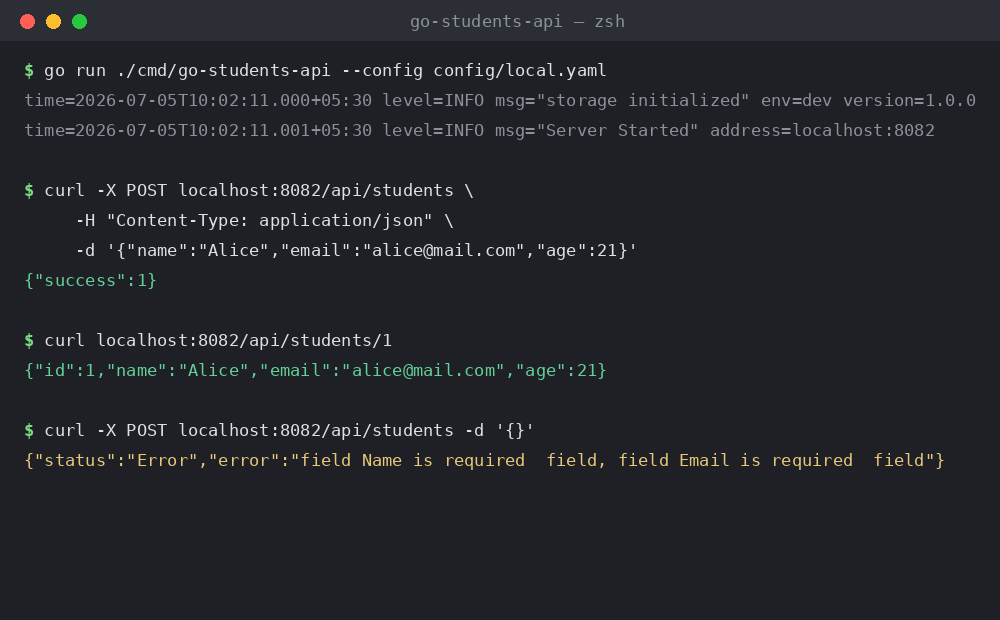

# Go Students API

A lightweight REST API for managing student records, built with **Go's standard `net/http` router** and **SQLite** for storage. It uses `cleanenv` for YAML-based configuration and `go-playground/validator` for request validation.



## Features

- Create, fetch-by-ID, and list student records
- SQLite persistence (auto-creates the `students` table on startup)
- YAML configuration via `cleanenv`, with environment-variable overrides
- Request validation with clear, field-level error messages
- Structured logging with `log/slog`
- Graceful shutdown on `SIGINT` / `SIGTERM`

## Tech Stack

| Component     | Library                                                        ||
|---------------|-----------------------------------------------------------------|
| HTTP router   | `net/http` (Go 1.22+ method/pattern routing)                    |
| Database      | [`mattn/go-sqlite3`](https://github.com/mattn/go-sqlite3)        |
| Config        | [`ilyakaznacheev/cleanenv`](https://github.com/ilyakaznacheev/cleanenv) |
| Validation    | [`go-playground/validator/v10`](https://github.com/go-playground/validator) |

## Project Structure

```
go-students-api/
├── cmd/
│   └── go-students-api/
│       └── main.go              # entry point: config, router, server lifecycle
├── config/
│   └── local.yaml                # local dev configuration
├── internal/
│   ├── config/                   # config loading (cleanenv)
│   ├── http/handlers/student/    # HTTP handlers for student endpoints
│   ├── storage/                  # storage interface
│   │   └── sqlite/               # SQLite implementation
│   ├── types/                    # shared data types (Student)
│   └── utils/response/           # JSON response + validation error helpers
├── go.mod
└── go.sum
```

## Getting Started

### Prerequisites

- Go 1.26+ (as declared in `go.mod`)
- GCC (required by `mattn/go-sqlite3`, which uses cgo)

### Installation

```bash
git clone https://github.com/dedsechack-1337/go-students-api.git
cd go-students-api
go mod tidy
```

### Configuration

Configuration is loaded from a YAML file. The path can be set via the `CONFIG_PATH` environment variable or the `--config` flag.

`config/local.yaml`:

```yaml
env: "dev"
storage_path: "storage/storage.db"
http_server:
  address: "localhost:8082"
```

### Run

```bash
go run ./cmd/go-students-api --config config/local.yaml
# or
CONFIG_PATH=config/local.yaml go run ./cmd/go-students-api
```

The server starts on the address defined in your config (`localhost:8082` by default).

## API Reference

### Create a student

```
POST /api/students
```

**Body**

```json
{
  "name": "Alice",
  "email": "alice@mail.com",
  "age": 21
}
```

**Response** `201 Created`

```json
{ "success": 1 }
```

### Get a student by ID

```
GET /api/students/{id}
```

**Response** `200 OK`

```json
{ "id": 1, "name": "Alice", "email": "alice@mail.com", "age": 21 }
```

### List all students

```
GET /api/students
```

**Response** `200 OK`

```json
[
  { "id": 1, "name": "Alice", "email": "alice@mail.com", "age": 21 }
]
```

### Validation errors

All fields (`name`, `email`, `age`) are required. Missing fields return `400 Bad Request`:

```json
{
  "status": "Error",
  "error": "field Name is required  field, field Email is required  field"
}
```

## Roadmap

- [ ] `PUT /api/students/{id}` — update a student
- [ ] `DELETE /api/students/{id}` — delete a student

These routes are already stubbed out (commented) in `main.go`.

## Known Issues

- `GetStudents` in `internal/storage/sqlite/sqlite.go` currently scans columns in the wrong order (`Id, Name, Name, Email` instead of `Id, Name, Email, Age`), so `GET /api/students` returns malformed records. This should be fixed to `rows.Scan(&student.Id, &student.Name, &student.Email, &student.Age)`.

## License

No license file is currently included in this repository. Add one (e.g. MIT) if you intend for others to reuse this code.
